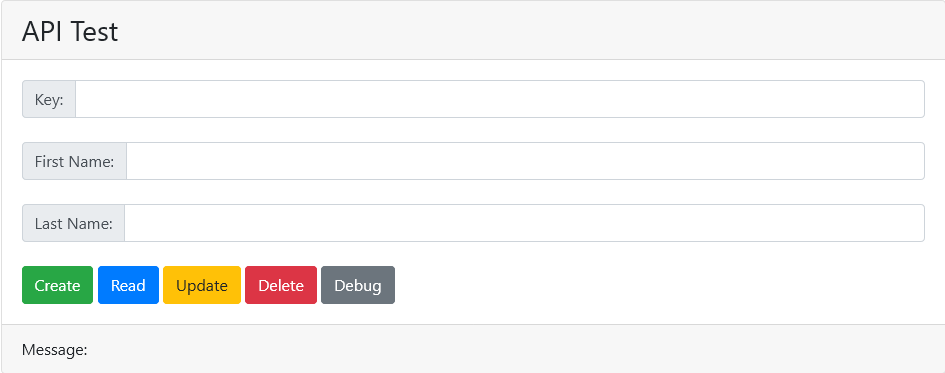

# FullStack Tutorial

[](https://jiangyiqun.github.io/ppm/)

In this fullstack tutorial, I will implement a simple CRUD App, including:
- A [Frontend](https://jiangyiqun.github.io/fullstack_tutorial/) using [JavaScript(React)](https://reactjs.org/)
- A [Backend](./docs/README.md) using [Python(Flask)](https://flask.palletsprojects.com/en/1.1.x/)

This CRUD App can manipulate a database which include a key and a pair of names, as follows:


___

## Implementation

One of the fancy part of web app is that it is seperated by layers.

- The top layer is [frontend](./frontend), which utilises the [APIs](./docs) provided by backend. When implementing [frontend](./frontend), we can assume that all the [APIs](./docs) has already been implemented.
- The middle layer is [backend](./backend), which utilises the functions in [dbms](./backend/dbms) to manipuate database. When implementing [backend](./backend), we assume that all the functions in [dbms](./backend/dbms) has already been implemented.
- The bottom layer is [dbms](./backend/dbms), which includes the implementation of manipulating database. I have provided a few implementations, they all have the same fuction interface.

You may start from any layer you prefer. If not sure, I recommend you to look at [APIs](./docs) first.

## Create Frontend from scratch

### Prerequisite

- [Node.js](https://nodejs.org)

### Create React App

```shell
npx create-react-app frontend     # create basic react app
cd frontend
npm install --save reactstrap     # install essitial modules
```

___

## Create Backend from scratch

### Prerequisite

- [Anaconda (Python 3)](https://www.anaconda.com/distribution/#download-section)

### Create Flask App

```shell
mkdir backend
cd backend
python3 -m venv python_modules          # create python environment
source ./python_modules/bin/activate    # activate python environment
pip install flask flask-cors     		# install essitial modules
python -m pip freeze > package-lock.txt		# save dependencies to package.txt
deactivate                              # deactivate python environment
```

**Alternatively, you could use [ppm](https://github.com/Jiangyiqun/ppm) (no available for Windows)**

```shell
mkdir backend
cd backend
ppm install
ppm install flask flask-cors           # install essitial modules
```
